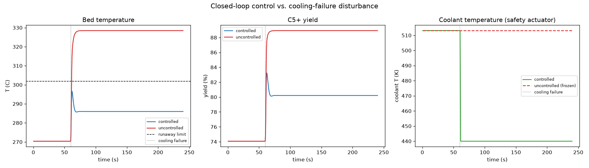
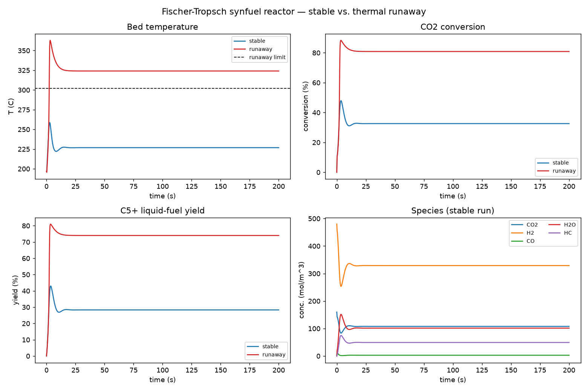
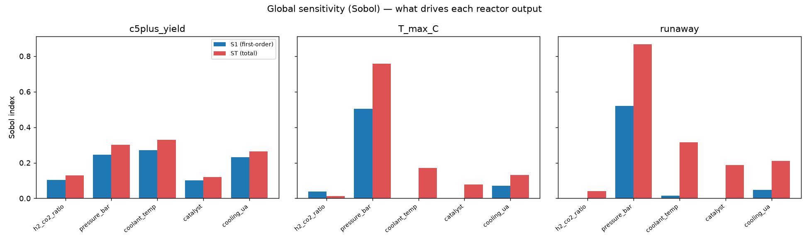
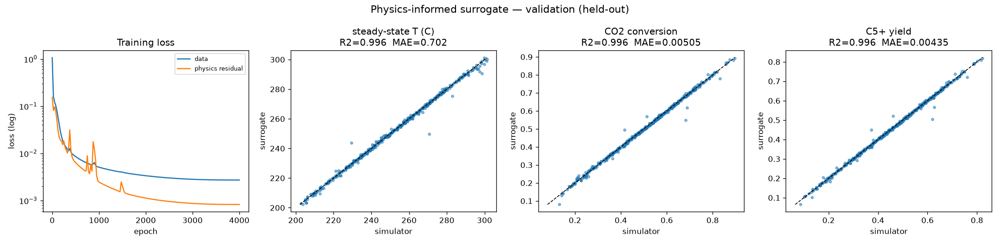
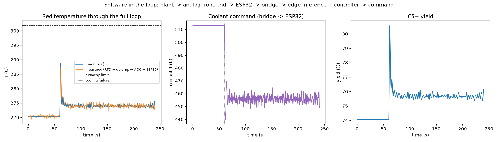

# Closed-Loop Control of a Simulated Fischer–Tropsch Synfuel Reactor via a Physics-Informed Neural Surrogate and Edge Inference

[](https://github.com/raahimnawaz/synfuel-control/actions/workflows/ci.yml)
[](LICENSE)
[](https://www.python.org/)


**Raahim Nawaz** · 2026

> A complete **sense → model → control → deploy** pipeline for a thermal-runaway-prone
> chemical reactor: first-principles simulation, a physics-informed neural network, a
> closed-loop controller, a dependency-free C++ edge engine, and an ESP32
> software-in-the-loop. *Simulated end-to-end.*



*Under a mid-run cooling failure, the closed-loop controller holds the reactor at
**296 °C (safe)** while the uncontrolled reactor runs away to **328 °C** — keeping ~80 % of
the liquid-fuel yield. This is the headline result; details in §4.*

## Key results

- **First-principles plant** with literature kinetics reproducing a thermal-runaway regime (Fig. 1).
- **Global sensitivity:** pressure dominates runaway risk (total-effect Sobol index ≈ 0.87); cooling capacity acts almost entirely through interactions (Fig. 2).
- **Physics-informed surrogate:** R² ≈ 0.996 on temperature, conversion, and C5+ yield (MAE ≈ 0.7 °C); ONNX matches PyTorch to ~10⁻⁴ (Fig. 3).
- **Closed-loop control:** controlled reactor stays safe at **296 °C** under a cooling failure that drives the uncontrolled reactor to **328 °C / runaway** (Fig. 4).
- **Edge inference:** hand-rolled C++ engine at **0.98 µs/inference**, ~4.8× faster than ONNX Runtime, max deviation **6.4 × 10⁻⁵**.
- **Full software-in-the-loop:** the distributed loop holds the reactor at **289 °C** through the disturbance, the C++ binary serving every in-loop inference (Fig. 5).

## Tech stack

`Python` · `PyTorch` · `ONNX / ONNX Runtime` · `NumPy` · `SciPy` · `Matplotlib` ·
`C++17 / CMake` · `ESP32 / Arduino` · `SPICE` · `pytest` · `GitHub Actions`

**Skills demonstrated:** control systems (RTO + PI feedback) · scientific / physics-informed ML ·
numerical simulation of stiff ODEs · global sensitivity analysis · C++ edge deployment ·
embedded firmware & analog circuit design · software-in-the-loop testing.

---

## Abstract

Power-to-liquid Fischer–Tropsch (FT) synthesis converts CO₂ + H₂ into liquid
hydrocarbons, but its large exothermicity makes the reactor prone to **thermal runaway**:
a positive feedback between temperature and reaction rate that, unchecked, destroys the
catalyst. This work develops and validates an **end-to-end, software-in-the-loop control
system** for such a reactor, spanning first-principles modeling, scientific machine
learning, real-time control, and embedded edge deployment.

A dynamic continuous-stirred-tank reactor (CSTR) model with literature-sourced kinetics
serves as the ground-truth plant. A Latin-hypercube design of experiments and
variance-based (Sobol) sensitivity analysis characterize the operating space and identify
**pressure as the dominant driver of runaway**. A **physics-informed neural network
(PINN)** surrogate predicts the reactor steady state, embedding species- and
energy-conservation residuals in its loss and reaching **R² ≈ 0.996** on held-out data. A
two-layer controller — real-time optimization (RTO) over the surrogate plus a PI safety
loop — **holds the reactor below the runaway limit through a cooling-failure disturbance
that otherwise causes runaway**, while preserving ~80 % C5+ yield. The surrogate is
deployed as a dependency-free C++ engine (**~0.98 µs per inference, ~4.8× faster than ONNX
Runtime, float32-identical**) targeting Jetson-class hardware, and the full
**sense → infer → actuate** loop is closed in software through a modeled analog
sensor front-end and an ESP32 node. All results are reproducible and continuously tested.

> **Scope.** The system is simulated end-to-end (software-in-the-loop); no physical
> reactor or microcontroller is involved. Each layer is structured to drop onto real
> ESP32 / Jetson Orin Nano hardware (§6).

## 1. Background and problem

FT synthesis on a cobalt catalyst proceeds, for a CO₂ + H₂ feed, in two coupled steps:

```
(1) reverse water-gas-shift   CO₂ + H₂  ⇌  CO + H₂O        ΔH ≈ +41 kJ/mol  (endothermic)
(2) Fischer–Tropsch growth    CO + 2 H₂  →  (–CH₂–) + H₂O   ΔH ≈ −165 kJ/mol (exothermic)
```

The Arrhenius temperature dependence of (2) combined with its strong exothermicity creates
the runaway feedback loop (hotter → faster → more heat). The product chain length follows
the **Anderson–Schulz–Flory (ASF)** distribution, so operating temperature trades **yield
and conversion against selectivity and safety**. The engineering objective is therefore a
constrained control problem: *maximize C5+ (liquid-fuel) yield subject to keeping the bed
below a runaway limit*, under disturbances and noisy measurements. Framed this way the
reactor is a control plant like any other — the contribution here is a complete,
reproducible pipeline from physics to a deployable controller.

## 2. System architecture

```
 reactor plant (ODE)
   → design of experiments + sensitivity analysis
   → physics-informed neural surrogate (ONNX)
   → RTO setpoint optimization + PI safety feedback
   → C++ edge inference engine
   → analog sensor front-end + ESP32 node  ──┐
   ↑___________________ closed loop _________│
```

| Module | Path | Role |
|---|---|---|
| Reactor model | `sim/` | First-principles CSTR ODE plant; coupled RWGS + FT kinetics, energy balance |
| Data science | `analysis/` | Latin-hypercube DoE, EDA, from-scratch Sobol sensitivity, sensor/ADC noise model |
| Surrogate | `pinn/` | Physics-informed MLP: inputs → steady state; conservation residuals in loss; ONNX export |
| Controller | `control/` | RTO over the surrogate + PI safety feedback |
| Edge engine | `edge/` | Hand-rolled dependency-free C++ inference; weights baked into a header |
| Embedded | `circuits/`, `firmware/`, `bridge/` | Analog front-end, ESP32 firmware, software-in-the-loop bridge |

## 3. Methods

### 3.1 Reactor model (`sim/`)

A lumped CSTR integrates six states `[CO₂, H₂, CO, H₂O, HC, T]` under the two reactions
above with a jacket energy balance, solved with a stiff integrator. Activation energies,
reaction enthalpies, and the ASF chain-growth probability are taken from the literature
(§References); only the rate pre-exponentials are fitted, as they are catalyst-specific
and routinely tuned per reactor. Sources for every constant are tabulated in
[`sim/CHEMISTRY.md`](sim/CHEMISTRY.md).

### 3.2 Design of experiments and sensitivity (`analysis/`)

Five inputs (feed H₂:CO₂ ratio, pressure, coolant temperature, catalyst loading, jacket
cooling capacity) are swept by Latin-hypercube sampling to build the dataset used for both
exploratory analysis and surrogate training. Global sensitivity uses first-order and
total-effect **Sobol indices** estimated with a from-scratch Saltelli scheme, validated
against the analytic **Ishigami** function in the test suite.

### 3.3 Physics-informed surrogate (`pinn/`)

A 64-wide tanh MLP (~5 k parameters) maps the five inputs to the 6-D steady state; yield,
conversion, and temperature are derived from it. The loss combines a data term with
**relative conservation residuals** (carbon balance, hydrogen balance, energy balance).
Using *relative* balances rather than the raw `dy/dt = 0` residual is essential: the bare
residual is numerically stiff (large production and consumption terms cancel), so it
fights the data fit, whereas the bounded relative form regularizes it. Input scaling and
output de-normalization are baked into the network so the exported ONNX graph consumes raw
physical inputs.

### 3.4 Controller (`control/`)

Two layers, mirroring a real process-control stack: (i) **RTO** finds the yield-maximizing
setpoint subject to a steady-state temperature ceiling via a batched search over the
vectorized surrogate; (ii) a **PI safety loop** regulates bed temperature by adjusting the
jacket coolant temperature, rejecting disturbances the surrogate never saw. Two findings
were decisive — *coolant temperature, not catalyst, is the effective actuator* (conversion
stays near-complete until catalyst is nearly fully cut), and *integral action is required*
(pure proportional control oscillates, with peaks exceeding the uncontrolled runaway).

### 3.5 Edge inference (`edge/`)

The trained surrogate is re-implemented as a hand-rolled C++ forward pass with weights
emitted as `constexpr` arrays — no Python, ONNX Runtime, or BLAS at runtime. The training
script emits the ONNX model and the C++ header from the same fitted network, so they
cannot drift.

### 3.6 Analog front-end and software-in-the-loop (`circuits/`, `firmware/`, `bridge/`)

The reactor's temperature and pressure are conditioned into a 0–3.3 V, 12-bit ADC window
by four analog stages (PT100 RTD divider, non-inverting op-amp, Wheatstone bridge with
instrumentation amplifier, RC anti-aliasing filter), each derived by hand in
[`circuits/ANALYSIS.md`](circuits/ANALYSIS.md), reproduced numerically by
[`circuits/verify.py`](circuits/verify.py), and provided as SPICE decks. An ESP32 firmware
node and a host bridge close the full loop in software, routing JSON telemetry/commands
identical to a real device (the standard hardware/software-in-the-loop pattern).

## 4. Results

#### Reactor dynamics and the runaway regime



**Figure 1.** Plant behavior. At a nominal operating point the bed settles near 227 °C
(stable); a cooling failure drives it past the 302 °C runaway limit. Panels: bed
temperature, CO₂ conversion, C5+ yield, and species concentrations.

#### Global sensitivity



**Figure 2.** First-order (S1) and total-effect (ST) Sobol indices for C5+ yield, peak
temperature, and runaway. Pressure dominates thermal safety (runaway ST ≈ 0.87); cooling
capacity contributes mainly through interactions (S1 ≈ 0).

#### Surrogate validation



**Figure 3.** Training losses (data and physics residual both decreasing) and held-out
parity for steady-state temperature, conversion, and C5+ yield. **R² ≈ 0.996** on all
three (temperature MAE ≈ 0.7 °C). The exported ONNX model matches PyTorch to ~10⁻⁴.

#### Closed-loop disturbance rejection


**Figure 4.** Response to a cooling failure (jacket capacity −67 %) at t = 60 s.

| Metric | Controlled | Uncontrolled |
|---|---:|---:|
| Peak temperature | **296 °C (safe)** | 328 °C → **runaway** |
| Final C5+ yield | 80 % | 89 % (not realizable — catalyst sinters) |

#### Edge inference benchmark

| Engine | Latency / inference | Speedup | Parity vs ONNX |
|---|---:|---:|---:|
| **Hand-rolled C++** | **0.98 µs** | **~4.8×** | max abs diff **6.4 × 10⁻⁵** |
| ONNX Runtime (Python) | 4.71 µs | — | — |

Benchmarked on host (Apple Silicon, `clang -O3`); see [`edge/bench.md`](edge/bench.md).
~1 µs is the bare inference time — far below the millisecond-scale control period, so
inference is never the loop bottleneck.

#### Full software-in-the-loop



**Figure 5.** The complete distributed loop (plant → analog front-end + ADC + noise →
ESP32 node → bridge → C++ inference + controller → command → plant) under the same cooling
failure. Bed temperature is held at **289 °C** (true plant vs. the signal measured through
the RTD → op-amp → ADC chain). The deployed C++ binary served all **480 in-loop
inferences**, tracking the true steady state to ~4 °C.

## 5. Reproducibility

```bash
uv venv --python 3.11 && uv pip install -e ".[dev]"

# Phase 1 — reactor dynamics (stable vs. runaway)
uv run python -m sim.run_sim

# Phase 2 — DoE, EDA, Sobol sensitivity, sensor-noise model
uv run python -m analysis.sample --n 512
uv run python -m analysis.eda
uv run python -m analysis.sensitivity --n 256
uv run python -m analysis.noise

# Phase 3 — train the physics-informed surrogate, export ONNX + C++ weights
uv run python -m pinn.train --n 2500 --epochs 4000

# Phase 4 — closed-loop control vs. a cooling-failure disturbance
uv run python -m control.closed_loop

# Phase 5 — build and benchmark the C++ edge engine
cmake -S edge -B edge/build -DCMAKE_BUILD_TYPE=Release && cmake --build edge/build
./edge/build/synfuel_edge --bench 2000000

# Phase 6 — verify the analog front-end and run the full software-in-the-loop
uv run python -m circuits.verify
uv run python -m bridge.run_sil

# Tests (physics conservation, Ishigami-validated Sobol, ONNX/C++ parity, loop safety)
uv run pytest -q
```

Continuous integration runs the test suite, builds the C++ engine, and exercises the full
pipeline on every push.

## 6. Limitations and scope

- **Simulated end-to-end.** The "plant" is the ODE model; the surrogate is trained on data
  generated from it. Kinetic parameters are literature-sourced and sensor noise is modeled,
  but no physical reactor is involved.
- **Software-in-the-loop, not hardware-in-the-loop.** The ESP32 firmware (`.ino`) and SPICE
  circuits are hardware-faithful and runnable in Wokwi / LTspice / Falstad, but are not
  flashed or simulated as part of CI (no embedded toolchain in the runner). The JSON
  protocol and calibration are shared between the firmware and the host bridge so the
  virtual node can be swapped for real hardware without changing the bridge.
- **Controller.** The control layer is RTO + PI feedback, not a receding-horizon MPC.

## 7. Repository layout

```
sim/        first-principles reactor model + chemistry writeup
analysis/   DoE, EDA notebook, Sobol sensitivity, sensor/ADC noise model
pinn/       physics-informed surrogate: model, loss, training, ONNX export
control/    RTO + PI safety controller, closed-loop simulation
edge/       hand-rolled C++ inference engine, CMake build, benchmark
circuits/   analog front-end analysis, calibration, SPICE decks
firmware/   ESP32 sketch + Wokwi project
bridge/     virtual ESP32 + software-in-the-loop runner
tests/      conservation, Sobol-vs-Ishigami, ONNX/C++ parity, loop safety
figures/    generated result figures
```

## References

1. M. E. Dry, "The Fischer–Tropsch process: 1950–2000," *Catalysis Today* **71** (2002) 227–241.
2. G. P. van der Laan, A. A. C. M. Beenackers, "Kinetics and selectivity of the Fischer–Tropsch synthesis: a literature review," *Catalysis Reviews* **41** (1999) 255–318.
3. I. C. Yates, C. N. Satterfield, "Intrinsic kinetics of the Fischer–Tropsch synthesis on a cobalt catalyst," *Energy & Fuels* **5** (1991) 168–173.
4. M. Raissi, P. Perdikaris, G. E. Karniadakis, "Physics-informed neural networks," *Journal of Computational Physics* **378** (2019) 686–707.
5. I. M. Sobol′, "Global sensitivity indices for nonlinear mathematical models and their Monte Carlo estimates," *Mathematics and Computers in Simulation* **55** (2001) 271–280.
6. A. Saltelli et al., "Variance based sensitivity analysis of model output," *Computer Physics Communications* **181** (2010) 259–270.
7. T. Ishigami, T. Homma, "An importance quantification technique in uncertainty analysis for computer models," *Proc. ISUMA* (1990) 398–403.

## License

Released under the MIT License — see [LICENSE](LICENSE).
